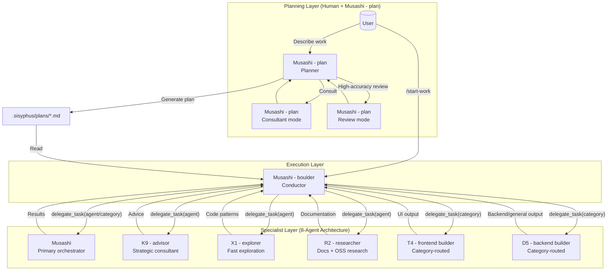
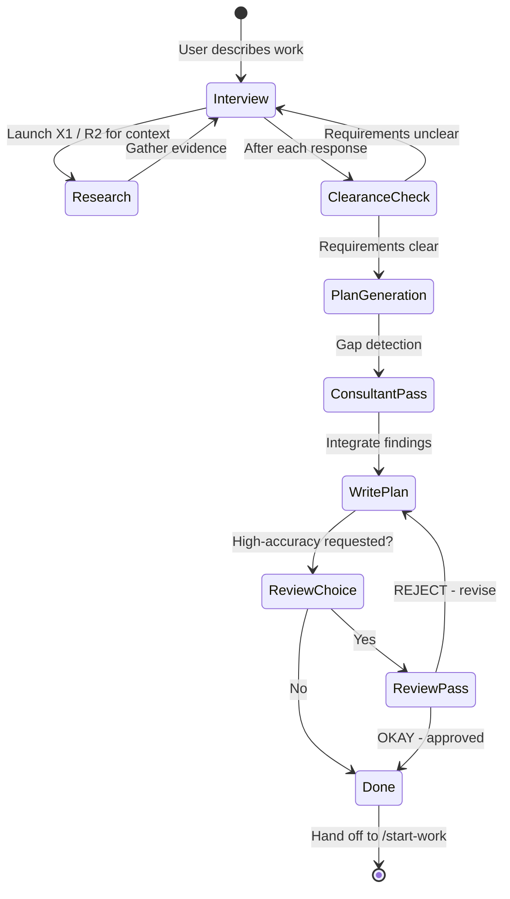
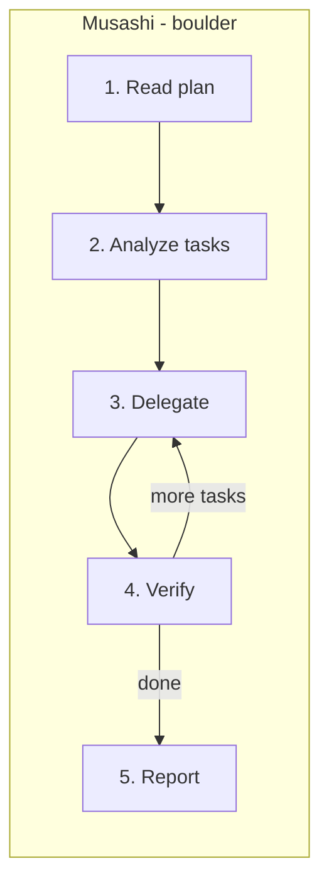
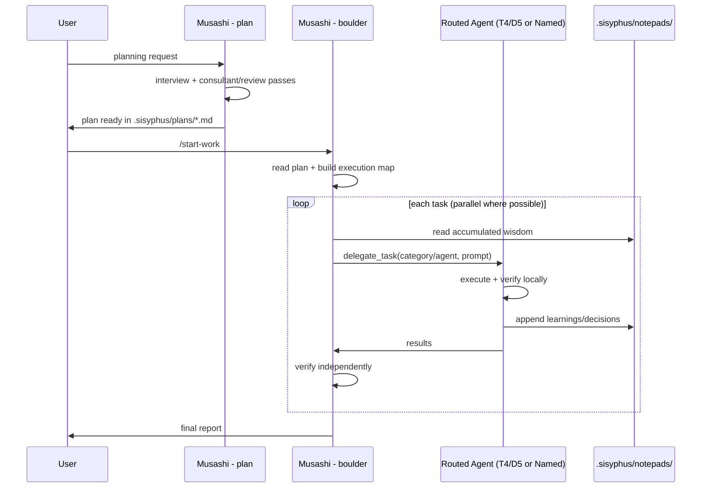

# Understanding the Orchestration System

Oh My OpenCode's orchestration system turns a single agent loop into a coordinated multi-agent workflow. This guide explains how **Musashi - plan -> Musashi - boulder -> specialist agents** produces high-quality, verifiable output at scale.

---

## The Core Philosophy

Traditional "user asks -> agent responds" loops degrade on large tasks because of:

1. **Context overload**: large tasks exceed practical working context
2. **Goal drift**: execution diverges from intent
3. **Verification gaps**: completion claims are not always validated
4. **Human bottlenecks**: too much manual steering

The orchestration system solves this with **role separation + explicit delegation + independent verification**.

---

## The Three-Layer Architecture



---

## Layer 1: Planning (Musashi - plan)

### Musashi - plan: Strategic Planner

Musashi - plan is an interviewer-first planner. It does not rush into implementation.

**Interview loop:**



**Intent-specific behavior:**

| Intent | Planner Focus | Typical Questions |
|--------|---------------|------------------|
| Refactoring | Behavior safety | "What tests prove current behavior?" |
| New feature | Scope boundaries | "What is explicitly out of scope?" |
| Architecture | Long-term fit | "What scale/lifespan assumptions matter?" |
| Mid-sized change | Guardrails | "What must not be modified?" |

### Consultant and Review Modes

Consultant mode and review mode are now internal Musashi - plan passes:

- **Consultant mode**: catches ambiguity, hidden requirements, over-engineering risk
- **Review mode**: validates clarity, acceptance criteria, references, and rollout safety
- **Outcome**: a plan file in `.sisyphus/plans/` that can be executed without guesswork

---

## Layer 2: Execution (Musashi - boulder)

### The Conductor Mindset

Musashi - boulder coordinates execution, does independent verification, and keeps state across sessions.



**What Musashi - boulder does directly:**
- Reads plan and repository context
- Runs diagnostics/tests for independent verification
- Tracks execution state in `boulder.json`

**What Musashi - boulder delegates:**
- Feature implementation and edits
- Large refactors and test authoring
- Domain-specific tasks (frontend, writing, architecture deep dives)

### Wisdom Accumulation

Every delegation cycle appends operational memory:

```text
.sisyphus/notepads/{plan-name}/
├── learnings.md
├── decisions.md
├── issues.md
├── verification.md
└── problems.md
```

This prevents repeated mistakes and stabilizes long-running work.

---

## Layer 3: Specialist Execution (Category-Routed + Named Agents)

### Category Routing (replaces fixed "junior" worker)

There is no standalone junior executor agent in the current architecture. Execution is routed by category:

| Category | Routed Agent | Auto Skills |
|----------|--------------|-------------|
| `visual-engineering` | `T4 - frontend builder` | `frontend-ui-ux`, `frontend-stack`, `component-stack` |
| `ultrabrain` | `D5 - backend builder` | `blueprint-architect`, `effect-ts-expert` |
| `artistry` | `T4 - frontend builder` | creative/design skills |
| `quick` | `D5 - backend builder` | `git-master`, `git-workflow` |
| `most-capable` | `D5 - backend builder` | `blueprint-architect`, `testing-stack` |
| `writing` | `D5 - backend builder` | `kenzo-agents-md`, `research-tools` |
| `general` | `D5 - backend builder` | `linearis`, `git-workflow`, `research-tools` |

### Named Agent Delegation

Use direct agent targeting when category routing is not enough:

- `K9 - advisor` for read-only strategic analysis
- `X1 - explorer` for fast local exploration
- `R2 - researcher` for external docs and OSS patterns
- `Musashi` for high-capability orchestration tasks

---

## The Orchestration Workflow



---

## Why This Architecture Works

1. **Separation of concerns**
   - Planning: Musashi - plan
   - Execution control: Musashi - boulder
   - Implementation: routed specialists

2. **Category abstraction over hardcoded workers**
   - Routing is intent-based, not tied to one fixed executor identity

3. **Verification-first completion**
   - Orchestrator validates outputs rather than trusting completion claims

4. **Cost/performance balance**
   - Expensive models used where strategic depth matters
   - High-throughput models used for execution and exploration

---

## Getting Started

1. **Enter planning mode**: Press **Tab** for Musashi - plan
2. **Describe the work**: include goals, scope, constraints
3. **Answer interview prompts**: clarify requirements and trade-offs
4. **Review plan**: check `.sisyphus/plans/*.md`
5. **Run `/start-work`**: let Musashi - boulder orchestrate
6. **Track progress**: inspect `.sisyphus/notepads/*` artifacts
7. **Ship**: after verification passes

---

## Further Reading

- [Overview](./overview.md) - Quick start
- [Ultrawork Manifesto](../ultrawork-manifesto.md) - Philosophy
- [Installation Guide](./installation.md) - Installation workflow
- [Configuration](../configurations.md) - Agent/category tuning
