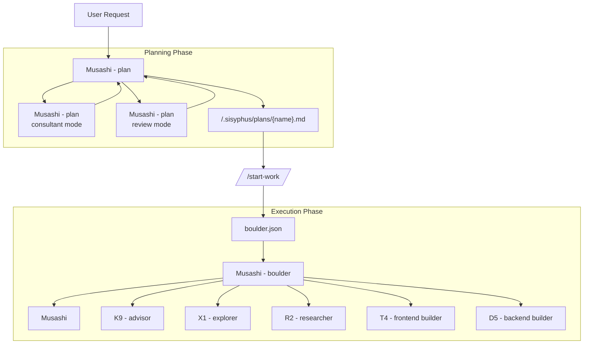

# Oh-My-OpenCode Orchestration Guide

## TL;DR - When to Use What

| Complexity | Approach | When to Use |
|------------|----------|-------------|
| **Simple** | Just prompt | Simple tasks, quick fixes, single-file changes |
| **Complex + Lazy** | Just type `ulw` or `ultrawork` | Complex tasks where explaining context is tedious. Agent figures it out. |
| **Complex + Precise** | `@plan` → `/start-work` | Precise, multi-step work requiring true orchestration. Musashi - plan creates the plan, Musashi - boulder executes it. |

**Decision Flow:**
```
Is it a quick fix or simple task?
  └─ YES → Just prompt normally
  └─ NO  → Is explaining the full context tedious?
             └─ YES → Type "ulw" and let the agent figure it out
             └─ NO  → Do you need precise, verifiable execution?
                        └─ YES → Use @plan for Musashi - plan planning, then /start-work
                        └─ NO  → Just use "ulw"
```

---

This document provides a comprehensive guide to the orchestration system that implements Oh-My-OpenCode's core philosophy: **"Separation of Planning and Execution"**.

## 1. Overview

Traditional AI agents often mix planning and execution, leading to context pollution, goal drift, and AI slop (low-quality code).

Oh-My-OpenCode solves this by clearly separating two roles:

1. **Musashi - plan**: Planning mode for interviews, scope definition, and executable plans.
2. **Musashi - boulder**: Execution orchestrator that runs the plan through delegation, verification, and stateful continuation.

---

## 2. Overall Architecture



---

## 3. Key Components

### 📐 Musashi - plan (Planning Layer)
- **Model**: `anthropic/claude-opus-4-5`
- **Role**: Strategic planning, requirements interviews, and work plan creation
- **Modes**: Consultant mode (gap discovery) and review mode (high-accuracy validation)
- **Constraint**: Planning-focused. Writes plans under `.sisyphus/` for execution handoff.

### 🪨 Musashi - boulder (Execution Layer)
- **Model**: `anthropic/claude-sonnet-4-5`
- **Role**: Orchestrates execution from plan files and state (`boulder.json`)
- **Characteristic**: Delegates aggressively, verifies independently, and preserves continuity across sessions

### 🧩 Specialist Layer (8-Agent Architecture)
- **Musashi** (`anthropic/claude-opus-4-5`): Primary orchestrator for high-complexity coordination
- **K9 - advisor** (`openai/gpt-5.2`): Read-only strategic consultant
- **X1 - explorer** (`anthropic/claude-haiku-4-5`): Fast codebase exploration
- **R2 - researcher** (`glm-4.7`): Multi-repo/docs/GitHub research
- **T4 - frontend builder** (user-configured model): Visual engineering via category routing
- **D5 - backend builder** (user-configured model): Backend/general/writing via category routing

---

## 4. Workflow

### Phase 1: Interview and Planning (Interview Mode)
Musashi - plan starts in **interview mode** by default. Instead of immediately creating a plan, it collects sufficient context.

1. **Intent Identification**: Classifies whether the user's request is Refactoring or New Feature.
2. **Context Collection**: Investigates codebase and external documentation through `X1 - explorer` and `R2 - researcher` agents.
3. **Draft Creation**: Continuously records discussion content in `.sisyphus/drafts/`.

### Phase 2: Plan Generation
When the user requests "Make it a plan", plan generation begins.

1. **Consultant Pass (Musashi - plan)**: Confirms missed requirements and risk factors.
2. **Plan Creation**: Writes a single plan in `.sisyphus/plans/{name}.md` file.
3. **Handoff**: Once plan creation is complete, guides user to use `/start-work` command.

### Phase 3: Execution
When the user enters `/start-work`, the execution phase begins.

1. **State Management**: Creates `boulder.json` file to track current plan and session ID.
2. **Task Execution**: Musashi - boulder reads the plan and processes TODOs one by one.
3. **Delegation**: UI work routes to `T4 - frontend builder`; complex logic routes to `D5 - backend builder` or `K9 - advisor` when strategic review is required.
4. **Continuity**: Even if the session is interrupted, work continues in the next session through `boulder.json`.

---

## 5. Commands and Usage

### `@plan [request]`
Invokes Musashi - plan to start a planning session.
- Example: `@plan "I want to refactor the authentication system to NextAuth"`

### `/start-work`
Executes the generated plan.
- Function: Finds plan in `.sisyphus/plans/` and enters execution mode.
- If there's interrupted work, automatically resumes from where it left off.

---

## 6. Configuration Guide

You can control related features in `oh-my-opencode.json`.

```jsonc
{
  "sisyphus_agent": {
    "disabled": false,           // Enable Musashi orchestration
    "planner_enabled": true,     // Enable Musashi - plan
    "replace_plan": true         // Route planning through Musashi - plan
  },
  
  // Hook settings (add to disable)
  "disabled_hooks": [
    // "start-work",             // Disable execution trigger
    // "prometheus-md-only"      // Remove Musashi - plan markdown restrictions (not recommended)
  ]
}
```

## 7. Best Practices

1. **Don't Rush**: Invest sufficient time in the interview with Musashi - plan. The stronger the plan, the faster execution becomes.
2. **Single Plan Principle**: No matter how large the task, contain all TODOs in one plan file (`.md`). This prevents context fragmentation.
3. **Active Delegation**: During execution, delegate to specialized agents via `delegate_task` rather than modifying code directly.
